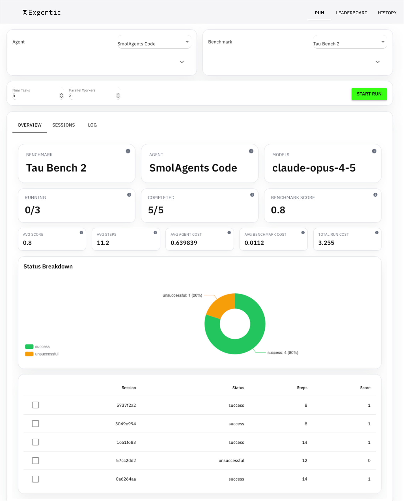
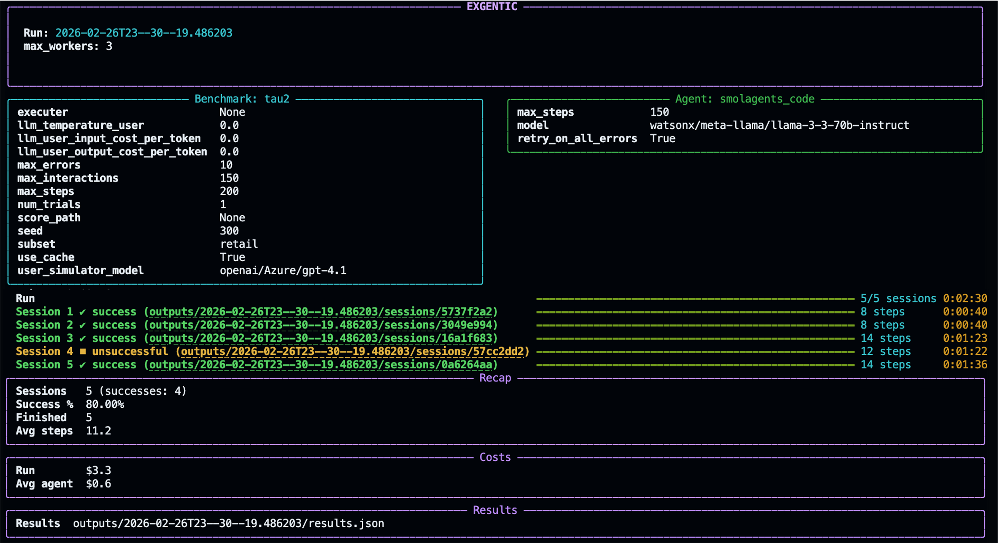

<p align="center">
  <strong>Evaluate any agent on any benchmark in the simplest way possible</strong>
</p>

--- 
## 🎯 What is Exgentic?

Exgentic is a universal evaluation framework that enables standardized testing of AI agents across diverse benchmarks and domains. It provides a consistent interface for evaluating any agent on any benchmark, making it easy to compare performance, reproduce results, and ensure your agent works reliably across different tasks and environments.

## 👥 Who is it for?
Exgentic serves multiple audiences in the AI agent ecosystem:
1. **General Audience** - Visit [www.exgentic.ai](https://www.exgentic.ai) to explore the first general agent leaderboard comparing leading agents and frontier models across varied tasks.
2. **Agent Builders** - Evaluate your agents comprehensively across multiple domains and benchmarks to ensure robust performance and identify areas for improvement.
3. **Researchers & Component Developers** - Test general agentic components (such as memory systems, context compression, planning modules) across different agents and domains to validate their effectiveness and generalizability.
4. **Benchmark Builders** - Evaluate your benchmark across multiple agents to ensure it provides meaningful differentiation and works reliably with different agent architectures.

---
## ✨ Key Features 

- 🔄 **Universal Evaluation Framework** - Evaluate any agent on any benchmark with a consistent, standardized interface
- 🤖 **Multi-Agent Support** - Built-in support for LiteLLM, SmolAgents, OpenAI MCP, and Claude Code agents
- 📊 **Comprehensive Benchmarks** - Industry-standard benchmarks including TAU2, AppWorld, SWE-bench, BrowseComp+, GSM8K, and HotpotQA
- 🔌 **Flexible LLM Integration** - Works with any LLM provider through LiteLLM (OpenAI, Anthropic, and more)
- 💻 **Multi-Interface** - Python API, CLI and GUI for different workflows and use cases
- 📈 **Interactive Dashboard** - Web-based interface for real-time monitoring and configuration
- 🔍 **Advanced Observability** - Comprehensive logging with trajectory tracking, OpenTelemetry integration, and detailed traces
- ⚙️ **Fine-Grained Control** - Configure model parameters, run limits, and benchmark/agent-specific settings
- 📁 **Structured Output** - Organized directory structure with session-level and run-level artifacts for easy analysis
- 💰 **Cost Tracking** - Automatic tracking of API costs and performance metrics
- 🏭 **Scalable** - Built-in caching, optimization, and monitoring features for scaled evaluations
- 🧩 **Extensibility** - Modular architecture makes it easy to add new agents or benchmarks

---

## 🚀 Quick Start

### 📋 Prerequisites

- Python 3.11 or higher
- Virtual environment (recommended)

### 📦 Installation

Clone the repository:
```bash
git clone <repository-url>
cd exgentic-research
```

Set up your environment:
```bash
python3.11 -m venv .venv
source .venv/bin/activate  # Windows: .venv\Scripts\activate
pip install -e ".[litellm,smolagents]"
```

### 🔧 Benchmark Setup

Run the setup command for each benchmark before first use:
```bash
exgentic setup appworld
exgentic setup tau2
```
### 🔑 API Credentials

Configure your API keys for OpenAI, Anthropic or any other platform support by LiteLLM.
```bash
# For OpenAI
export OPENAI_API_KEY=...          # your OpenAI API key

# Or for Anthropic
export ANTHROPIC_API_KEY=...       # your Anthropic API key
```
Alternatively, create a `.env` file in the project root with your API keys. Exgentic will load them automatically.

---

## 💡 Usage Examples

### 🖥️ CLI Usage

**TAU2 Benchmark with LiteLLM**

```bash
exgentic list benchmarks
exgentic list agents

# Using OpenAI
exgentic evaluate --benchmark tau2 --agent tool_calling --subset retail --num-tasks 2 \
  --model gpt-4o \
  --set benchmark.user_simulator_model="gpt-4o" \
  --output-dir ./outputs

# Or using Anthropic
exgentic evaluate --benchmark tau2 --agent tool_calling --subset retail --num-tasks 2 \
  --model claude-3-5-sonnet-20241022 \
  --set benchmark.user_simulator_model="claude-3-5-sonnet-20241022" \
  --output-dir ./outputs
```


---

## 📊 Available Benchmarks

You can see all available benchmarks using:

```bash
exgentic benchmark list
```

You can install and use any of these:
- 🎯 **tau2** - Simulated customer support tasks across multiple domains (retail, airline, banking) with realistic user interactions
- 📱 **appworld** - Multi-app API environment testing agents' ability to interact with various application interfaces
- 🌐 **browsecompplus** - Web search and browsing benchmark evaluating information retrieval and navigation capabilities
- 💻 **swebench** - Software engineering benchmark for resolving real-world GitHub issues in Python repositories

There are two simple example benchmarks:
- 📚 **hotpotqa** - Multi-hop question answering over Wikipedia requiring reasoning across multiple documents
- 🔢 **gsm8k** - Grade school math word problems (GSM8K dataset) with optional calculator tool support

---

## 🤖 Available Agents

### ⚡ LiteLLM Tool Calling
**Setup:** `pip install -e ".[litellm]"`

### 🧠 SmolAgents Tool calling and Code Agents

**Setup:** `pip install -e ".[smolagents]"`

### 🔷 OpenAI Solo
**Setup:** `pip install -e ".[openaimacp]"`

### 🎨 Claude Code
**Setup:** To be added...

---

## 📈 Dashboard Interface



Launch the interactive dashboard:

```bash
exgentic dashboard
```

The dashboard provides a web interface where you can:
1. Select benchmarks and agents from the sidebar
2. Configure parameters in the 'Run' tab
3. Initiate evaluations with the 'Run' button
4. Monitor progress and view results in real-time

---

## 📁 Output Structure

Each run creates its own directory under `outputs/<run_id>/`:

```text
outputs/<run_id>/
├── benchmark_results.json          # Benchmark-specific aggregated results
├── results.json                    # Overall scores, costs, and per-session statistics
├── run/
│   ├── config.json                # Snapshot of benchmark and agent configuration
│   ├── run.log                    # Main execution log
│   ├── error.log                  # Error that cause session to fail
│   ├── warnings.log               # Warnings and issues during execution
│   └── litellm/
│       └── trace.jsonl            # LiteLLM API traces (if using LiteLLM)
└── sessions/<session_id>/
    ├── config.json                # Session-specific configuration
    ├── results.json               # Framework-level results for the session
    ├── session.json               # Session metadata
    ├── trajectory.jsonl           # One JSON line per step (action + observation)
    ├── agent/
    │   ├── agent.log             # Agent execution log
    │   └── litellm/
    │       ├── cache.log         # LiteLLM cache operations
    │       └── trace.jsonl       # Agent-specific LiteLLM traces
    └── benchmark/
        ├── config.json           # Benchmark configuration
        ├── results.json          # Benchmark-specific results
        ├── session.log           # Benchmark adaptor log
        └── [benchmark-specific files]
```

### TAU2-Specific Files

For TAU2 runs, additional files appear under `sessions/<session_id>/benchmark/`:

| File | Description |
|------|-------------|
| `dialog.log` | Human-readable conversation transcript |
| `tau2_session.log` | TAU2 framework internal log |


---

### 📝 CLI Reference



**Common Commands**
```bash
exgentic list benchmarks
exgentic list subsets --benchmark tau2
exgentic list tasks --benchmark tau2 --subset retail --limit 5
exgentic list agents
exgentic evaluate --benchmark tau2 --agent tool_calling --subset airline --task 12 --task 34
exgentic evaluate --benchmark tau2 --agent tool_calling --subset airline --num-tasks 10 \
  --set benchmark.user_simulator_model="gpt-4o" \
  --set agent.max_steps=20 \
  --max-steps 100 \
  --max-actions 100
exgentic evaluate execute --benchmark tau2 --agent tool_calling --subset airline --num-tasks 10
exgentic evaluate aggregate --benchmark tau2 --agent tool_calling --subset airline --num-tasks 10
exgentic evaluate session --benchmark tau2 --agent tool_calling --subset airline --task 12
exgentic evaluate session --config session_config.json
exgentic status --benchmark tau2 --agent tool_calling --subset airline --num-tasks 10
exgentic preview --benchmark tau2 --agent tool_calling --subset airline --num-tasks 10
exgentic results --benchmark tau2 --agent tool_calling --subset airline --num-tasks 10
```

## 🐍 Python API

For Python API usage examples, see the [`examples/`](./examples/) directory.

## 📖 How It Works

To learn more about Exgentic's architecture and design, see our arXiv paper: [Coming soon]

## 🤝 Contributing

We welcome issues and pull requests! Please see [`CONTRIBUTING.md`](./CONTRIBUTING.md) for guidelines.

---

## ⚙️ Advanced Features

### 🎛️ Model Configuration
```bash
exgentic evaluate --benchmark tau2 --agent tool_calling --subset retail --num-tasks 2 \
  --set agent.model.temperature=0.2
```

**Supported fields:** `temperature`, `top_p`, `max_tokens`, `reasoning_effort`, `num_retries`, `retry_after`, `retry_strategy`

> Agents will warn and ignore any unsupported fields.

### ⏱️ Run Limits
```bash
exgentic evaluate --benchmark tau2 --agent tool_calling --subset retail --num-tasks 2 \
  --max-steps 100 \
  --max-actions 100
```

The Exgentic stops a session when it reaches either limit and records a `limit_reached` status.
**Default:** 100 for both limits

### 🔍 OpenTelemetry Tracing

Enable distributed tracing for your agent evaluations:

1. **Install dependencies:**
   ```bash
   pip install -e .[otel]
   ```

2. **Set up an OTEL Collector:**
   Use [Jaeger](https://www.jaegertracing.io/) or [Langfuse](https://langfuse.com/). See the [OpenTelemetry Collector documentation](https://opentelemetry.io/docs/collector/) for details.

3. **Configure environment variables:**
   ```bash
   export OTEL_EXPORTER_OTLP_ENDPOINT=http://localhost:4317
   export OTEL_EXPORTER_OTLP_PROTOCOL=http/protobuf  # or 'grpc'
   export EXGENTIC_OTEL_ENABLED=true
   ```

4. **View traces:**
   OTEL logs are written to `<session_root>/otel.log`

---

## 📄 License

This project is licensed under the Apache License 2.0 - see the [LICENSE](LICENSE) file for details.

## 💬 Support

For questions and support, please [open an issue](https://github.com/your-repo/issues) on GitHub.
